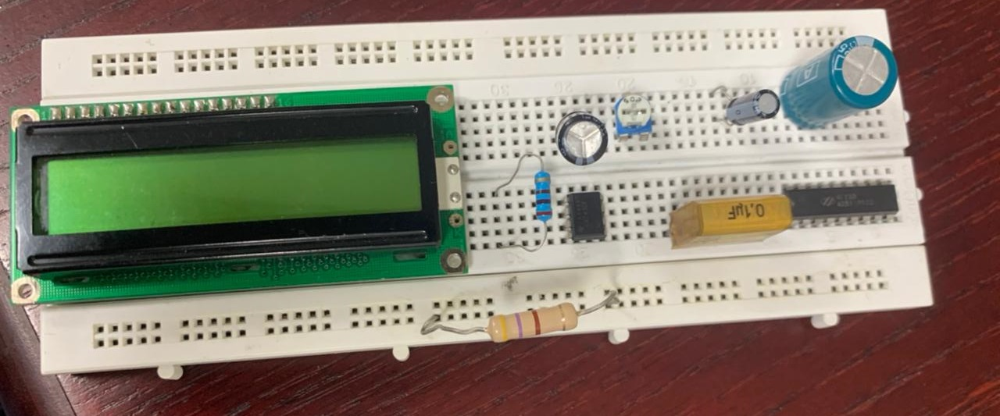
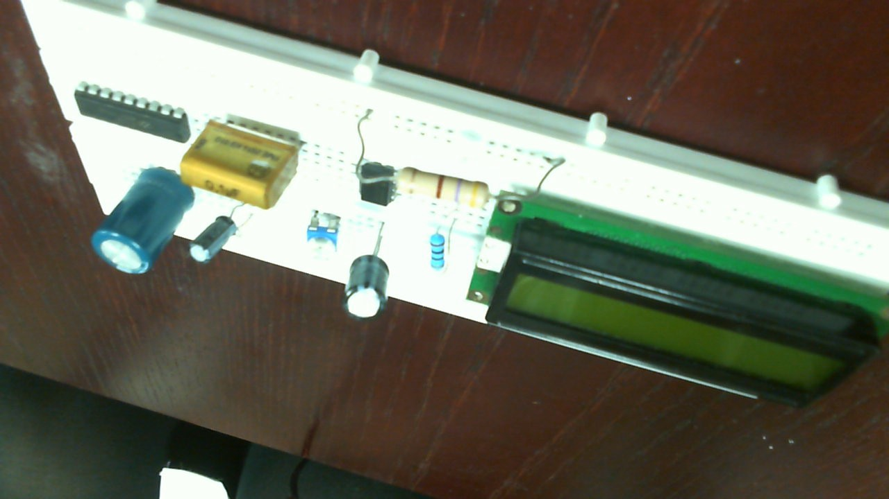
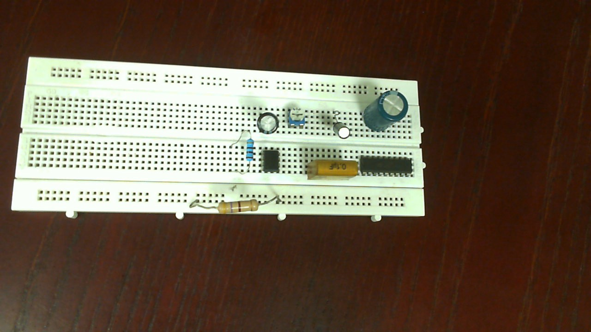
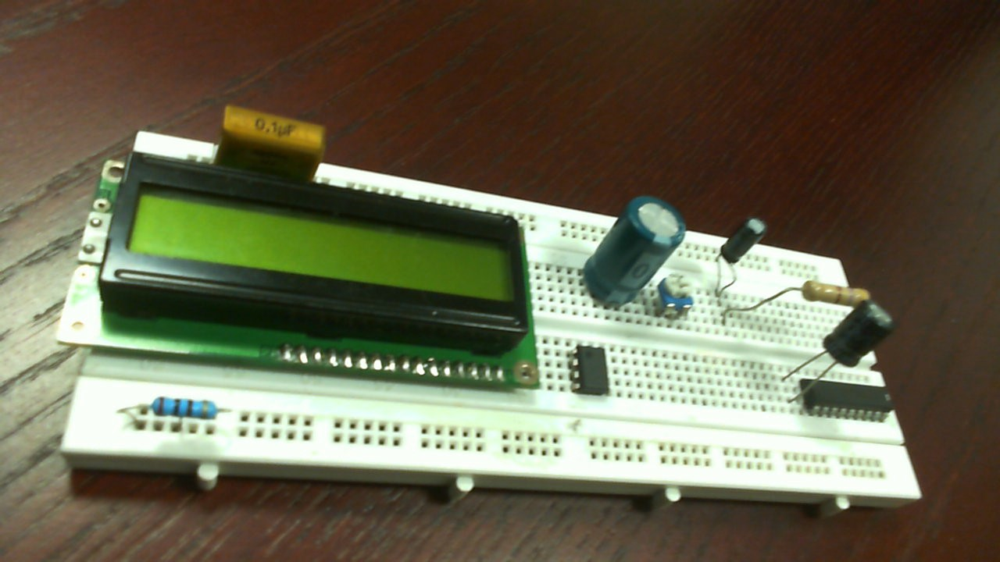
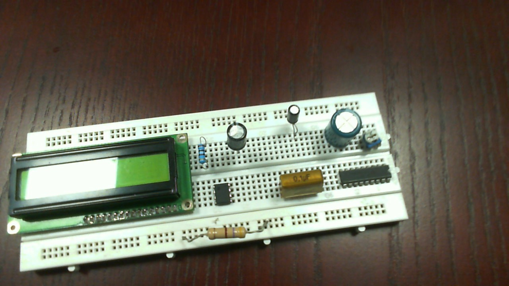
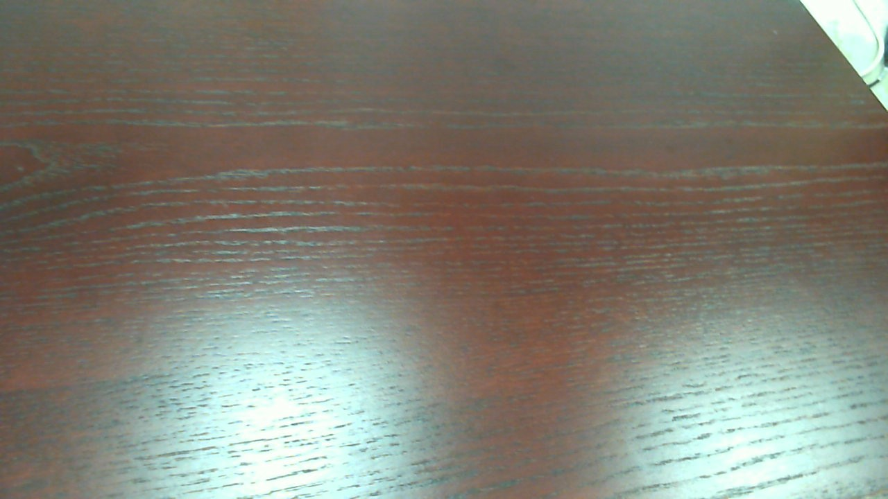
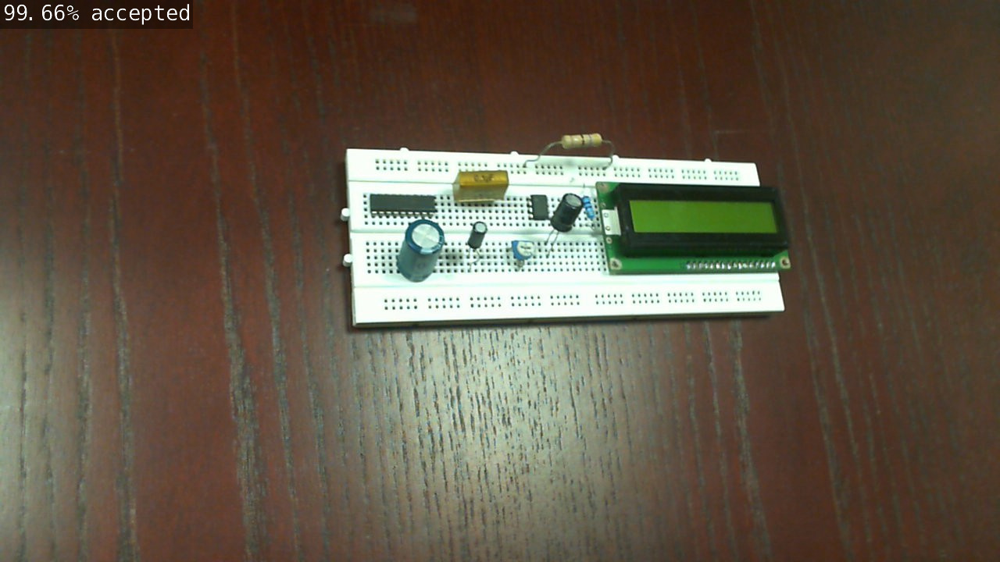
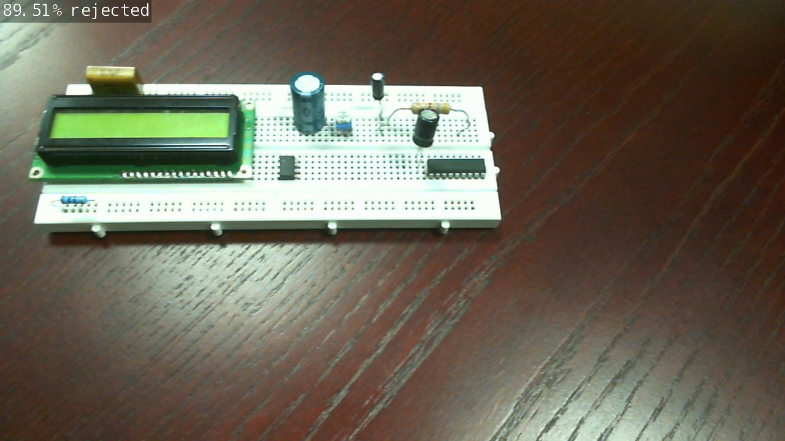
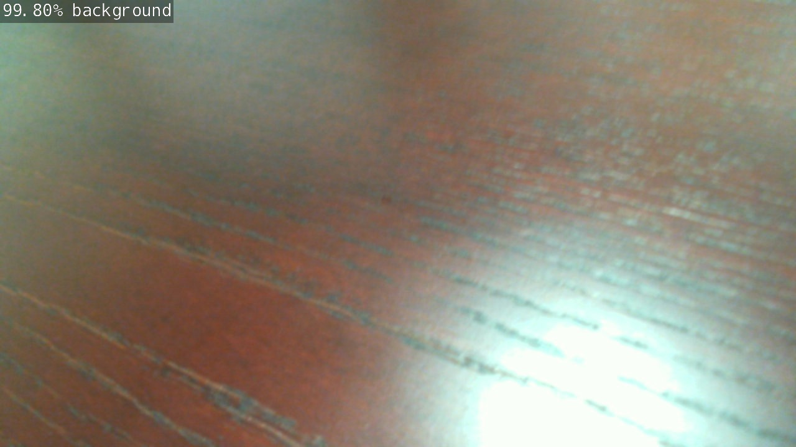

https://user-images.githubusercontent.com/86342191/128978225-1988285b-63bc-45c6-bce9-abe1f3d0b420.mp4

# Quality Control Project 
        
## Products Defect Detection

___
### Introduction

This project is a part of the [Jetson AI Specialist](https://developer.nvidia.com/embedded/learn/jetson-ai-certification-programs) from [NVIDIA’s Deep Learning Institute (DLI)](https://www.nvidia.com/en-us/training/). Where the learner should apply an open-source project of his choice, deploying **AI** application using **NVIDIA's Jetson**.

For my project, I decide to build a system in the **Quality Control** field, to detect any defects in a certain product within a product line *automatically*.

The system will be constructed of a **USB camera** connected to a **Jetson Nano**, the camera will *observe* the products that are passing over a *conveyor belt*, sending a live stream to the Jetson which is using **AI and computer vision** techniques to classify each product as eiather an **accepted** piece or **defected** one.

### Methodology

#### Collecting Data
To accomplish the task, I have assembled some electronic components into a board to create what is supposed to be my actual product. The image below shows the complete accepted product that the production line shall produce.



After I've assembled the product, 10,000 images have been taken for the product, 5000 for each class.

- For the **accepted** class, 5000 images have been taken for the same combination shown above. The images shows the product from different *orientations*, diffierent *distances* and with different *lighting*.

##### Accepted example


- For the **defected** or what has called **rejected** class, the product assumed to be rejected in many cases, and the 5000 rejected images represents all these cases:
        1. Missing component in the product 


        2. One or more component at a wrong location 


        3. Replaced components position 



- Or any combination of these defects

>**Note**: to demonstrate an empty *conveyor belt* where the camera sees no object (neither accepted nor defected/rejected) a few images (about 120) have been taken under a new class labeled as **'background'**.


#### Data Splitting

After collecting the data, they splitted to three categories: Training (train), Validation (val) and Testing (test).
Where for each class, the data has been splitted as follows:
* `75%` of data for training
* `20%` for validation
* `5%` for testing


#### Training

To train the system, I decide to use transfer learning using the **`ResNet-18`** architecture; to get better accuracy using the limited data that collected previously.

So, I use the [Jetson Inference](https://github.com/dusty-nv/jetson-inference) docker container from the course. For more information on mounting the container and run it you can follow this [link](https://github.com/dusty-nv/jetson-inference/blob/master/docs/aux-docker.md).

Firstly, after mounting the Jetson Inference docker container, the container should be ran using the following commands from Jetson Nano's terminal:

```bash
cd jetson-inference
docker/run.sh
```
After that, we should navigate to *classification* directory in the container where the training codes live:

```bash
cd python/training/classification
```

>**Note**: Before moving forward for training, the data should be transfered to a directory called **QC** in the location *jetson-inference/python/training/classification/data/*.
This directory contains the splitted data (train,val,test) and labels.txt

Then, the training code `train.py` was used. On the begining the model has trained for `5` epochs only to observe while it is improving or not, with batch size of `16`:
```bash
python3 train.py --model-dir=models/QC data/QC --batch-size=16 --epochs=5
```
After being sure of the model improvement, I ran the code for the default `35` epochs:
```bash
python3 train.py --model-dir=models/QC data/QC --batch-size=16
```

After completing the `35` epochs, the model **best accuracy** reached **`98.765 %`**, with only 10,000 training images; which is the magic of using **Transfer Learning**.

#### Converting the Model to ONNX

As done in the course, to process images and test our model using **TensorRT**, we should convert the model to [ONNX format](https://onnx.ai/), so we run the following command:
```bash
python3 onnx_export.py --model-dir=models/QC
```

#### Testing 

**Test on Static images using TensorRT**

To test the model on the test images, we will make directories for each class:
```bash
mkdir data/QC/test_output_accepted data/QC/test_output_rejected data/QC/test_output_background
```
Then we run the following commands to process all the test images using our new model:
```bash
imagenet --model=models/QC/resnet18.onnx --input_blob=input_0 --output_blob=output_0 --labels=data/QC/labels.txt data/QC/test/accepted data/QC/test_output_accepted
```

```bash
imagenet --model=models/QC/resnet18.onnx --input_blob=input_0 --output_blob=output_0 --labels=data/QC/labels.txt data/QC/test/rejected data/QC/test_output_rejected
```

```bash
imagenet --model=models/QC/resnet18.onnx --input_blob=input_0 --output_blob=output_0 --labels=data/QC/labels.txt data/QC/test/background data/QC/test_output_background
```

**Testing Summary:**

**Class** | **Accuracy**
-------- | ---------------
Accepted | 96% (240/250)
Rejected | 96.4% (241/250)
Background | 100% (6/6)
**Overall** | `96.25% (478/506)`


**Testing Examples:**

        1. Accepted 


        2. Rejected 


        3. Background 


**Test on Live Stream**

To test the model on live strem, which is the ultimate goal of this project for production lines, the following command was ran:

```bash
imagenet.py --model=models/QC/resnet18.onnx --input_blob=input_0 --output_blob=output_0 --labels=data/QC/labels.txt /dev/video0
```

The following video shows the results:

https://user-images.githubusercontent.com/86342191/128978269-591c43a6-f74d-4f8b-a3a5-d454a0c74322.mp4


# Wish You Enjoy the Tour!
